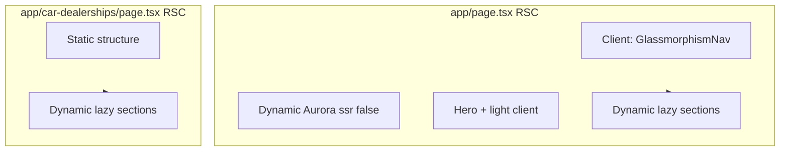

# Performance and bundle optimization plan

Reference only — not implemented yet.

**Overview:** Roll out the audited improvements in phases: fix Next/Image and fonts, shrink the critical-path JS bundle via dynamic imports and an RSC shell for `/car-dealerships`, tighten navigation behavior, then clean dead code and restore strict TypeScript builds.

## Tasks

- [ ] Enable Next image optimization; add sizes; migrate ai-team `` to next/image
- [ ] Wire Geist from geist/font in layout; align CSS variables with globals.css
- [ ] next/dynamic + ssr:false for Aurora with fallback; optional lazy below-fold on home
- [ ] Refactor car-dealerships page to RSC shell + client islands + same Aurora/lazy pattern
- [ ] Remove prod console.logs; non-blocking router.push with visual-only transitions
- [ ] Remove ignoreBuildErrors; fix all build-time TS errors
- [ ] Delete unused components; drop recharts/unused deps after import audit
- [ ] Build, lint, spot-check pages and Speed Insights on preview

## Scope

Implements the items from the prior audit: **image optimization**, **Geist font alignment**, **code-splitting heavy client islands** (Aurora + below-fold), **RSC shell for car-dealerships**, **faster / cleaner navigation**, **remove dev noise**, **dead code / deps**, and **remove `ignoreBuildErrors`**. **Cache Components / `use cache`** stay out of this pass (no server `fetch` yet); add when you introduce CMS or shared server computation.

## Architecture (target)

## Phase 1 — Config and images

**Files:** [`next.config.mjs`](../next.config.mjs), [`components/glassmorphism-nav.tsx`](../components/glassmorphism-nav.tsx), [`components/split-screen-before-after.tsx`](../components/split-screen-before-after.tsx), [`components/footer.tsx`](../components/footer.tsx), [`components/ai-team-section.tsx`](../components/ai-team-section.tsx) (raw `` ~299–359).

- Remove **`images.unoptimized: true`** so Vercel/Next can resize, serve modern formats, and respect `sizes`.
- Audit every **`next/image`** usage: `width`/`height`, add **`sizes`** where images are responsive (nav logo, full-width hero-like assets, split-screen imagery).
- Replace **``** in ai-team-section with **`next/image`** where appropriate.

**Note:** Image paths are under **`/public/images`** — no `remotePatterns` unless you add external URLs later.

## Phase 2 — Fonts (Geist + CSS variables)

**Files:** [`app/layout.tsx`](../app/layout.tsx), [`app/globals.css`](../app/globals.css), [`package.json`](../package.json).

- Import **GeistSans** / **GeistMono** from `geist/font` (per package docs) and apply **`variable`** classes on `<html>` or `<body>` alongside **Dancing_Script** / **Caveat** from `next/font/google`.
- Align **`--font-geist-sans`** / **`--font-geist-mono`** with what [`globals.css`](../app/globals.css) `@theme` expects (`--font-sans`, `--font-mono`).

## Phase 3 — Critical-path JS: dynamic imports + Suspense

**Primary files:** [`app/page.tsx`](../app/page.tsx), [`components/Aurora.tsx`](../components/Aurora.tsx) (unchanged inside; load via dynamic wrapper).

- Wrap **Aurora** with **`next/dynamic`** and **`ssr: false`**, plus a lightweight fallback (e.g. fixed gradient) inside **`Suspense`** so first paint does not wait on WebGL + `ogl`.
- Optionally split **below-the-fold** (testimonials, ROI calculator, AI team — largest bundles first) with **`next/dynamic`** and **`loading`** placeholders.

**Car dealerships:** [`app/car-dealerships/page.tsx`](../app/car-dealerships/page.tsx) is entirely **`"use client"`** — refactor to:

1. **Server page:** JSX shell + imports of client section components only.
2. Remove top-level **`"use client"`** from the page; keep interactivity in existing client components.
3. Same **Aurora dynamic + optional lazy sections** as home.

## Phase 4 — Navigation and transitions (INP / perceived speed)

**Files:** [`components/navigation-transition.tsx`](../components/navigation-transition.tsx), [`components/page-transition.tsx`](../components/page-transition.tsx), [`components/glassmorphism-nav.tsx`](../components/glassmorphism-nav.tsx).

- Remove or gate **`console.log`** behind `process.env.NODE_ENV === "development"`.
- **Replace blocking navigation:** avoid **`preventDefault`** + **`setTimeout(..., 300)`** then **`router.push`**. Prefer **`router.push` immediately** and visual-only transitions (overlay fade on pathname, CSS on `PageTransition`).

## Phase 5 — TypeScript build strictness

**File:** [`next.config.mjs`](../next.config.mjs).

- Set **`typescript.ignoreBuildErrors`** to **`false`** (or remove the block).
- Run **`pnpm build`**, fix errors until green.

## Phase 6 — Dead code and unused dependencies

Verify with grep (zero imports) before removing:

- [`components/PixelBlast.tsx`](../components/PixelBlast.tsx), [`components/GradualBlur.tsx`](../components/GradualBlur.tsx) — three, postprocessing, mathjs.
- [`components/ui/chart.tsx`](../components/ui/chart.tsx) + **recharts** in package.json if unused.

Optional: **`pnpm why`** / bundle analyzer after removals.

## Phase 7 — Verification

- **`pnpm build`** and **`pnpm lint`** clean.
- Manual: home + `/car-dealerships` — LCP, internal links, Aurora still runs.
- **Vercel Speed Insights** in [`app/layout.tsx`](../app/layout.tsx): compare on preview.

## Out of scope (follow-ups)

- **`cacheComponents: true`** / **`"use cache"`** — when you add CMS, MDX, or tagged invalidation.
- Splitting [`split-screen-before-after.tsx`](../components/split-screen-before-after.tsx) — only if maintainability or more lazy boundaries need it.
